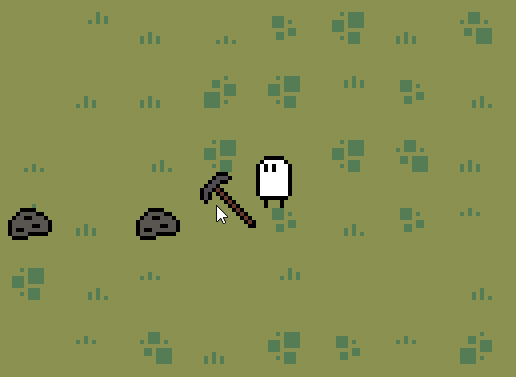

# Hoarder
Hoarder aims to be an indie 2d pixel-art game.

Development process can be really slow at the early stages because I have no prior experience with Godot engine and I will be learning this engine along the way.

100 day update - the game is at really early stage of development, but I'm happy that I was able to maintain (nearly) perfect 100 days of commits. During that time I have done few unpublished smaller games and learned at least basics of Godot engine. Unfortunately I haven't made much progress here, so I hope that I will return to this project soon.

